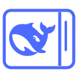

<div align="center">

<p align="center">
  
</p>

# DeepSeek Sidebar

**Keep DeepSeek beside your work, not behind another tab.**

Use the official DeepSeek web app in Chrome's native side panel, with selected text just one action away.

[](LICENSE)


[Download](../../releases/latest) · [Privacy](docs/PRIVACY.md) · [Contributing](CONTRIBUTING.md) · [简体中文](README.md)

</div>

---

## The official experience, alongside your workflow

DeepSeek Sidebar embeds **[chat.deepseek.com](https://chat.deepseek.com/)** in Chrome's native side panel. There is no replacement chat UI, third-party model API, or API key to configure. Accounts, models, history, and messaging remain part of the official website.

- **A full-size official web app.** No custom toolbar or composer in the panel.
- **Selected text in one action.** Send a selection to the official composer through the context menu or a keyboard shortcut.
- **Your draft stays yours.** Text is appended in order, preserving existing content. Messages are never submitted automatically.
- **Per-window queues.** Selections wait locally until a composer is available; retry and clear actions are in the extension icon's context menu.
- **No extension backend or telemetry.** Zero third-party runtime dependencies, with documented permissions and data flow.

**Validation status:** The current release has passed manual end-to-end acceptance in Chrome, including official-site login, side-panel messaging, and the selection workflow. Automated tests separately cover draft preservation, no automatic submission, queue isolation, and scoped embedding rules. See [Testing](docs/TESTING.md) for scope and reproduction.

## Install

Requires **Chrome 116+**; the latest stable version is recommended.

1. Download `deepseek-sidebar-*.zip` from [Releases](../../releases/latest) and extract it.
2. Open `chrome://extensions/` and enable **Developer mode**.
3. Choose **Load unpacked**, then select the directory containing `manifest.json`.
4. Pin **DeepSeek 小副屏** in Chrome's extensions menu.
5. Click the icon and sign in to the official website.

No build step or npm installation is required. Keep the extracted folder in place while Chrome uses it. To update, replace its contents and reload the extension; save any unsent draft first.

## Use

Click the  in the toolbar to open the panel. The whale icon identifies the project and its entry in extension management; the simple sidebar icon makes the toolbar action easy to recognize at small sizes.

Select text on a web page, right-click, and choose **添加到 DeepSeek 输入框（不发送）** (“Add to DeepSeek composer — do not send”). Review the text in the official composer and send it yourself.

The default shortcut is **Alt + Shift + D**, or **Option + Shift + D** on macOS. Configure it at `chrome://extensions/shortcuts`. Extension-owned menu labels are currently in Simplified Chinese; the web app controls its own language.

Right-click the extension icon to open the official website in a tab, retry pending additions, or clear the current window's queue. The badge shows pending items; **!** indicates an error available in the icon tooltip.

Each window accepts up to 20 pending selections of up to 60,000 characters each. Clearing the queue does not erase the official draft, and an already dispatched write may still finish. If text is present despite a timeout, clear rather than retry to avoid duplication.

## Privacy and security

The extension does not collect credentials, create user accounts, or run analytics, ads, or a content proxy. Pending text is stored in local session storage. Once added to the official composer, website handling is governed by DeepSeek's policies.

Persistent host access is restricted to `chat.deepseek.com`. Selection reading on other pages requires a user action.

**Embedding trade-off:** The extension removes framing restrictions and CSP response headers from matching official-site subframes initiated by this extension. This weakens some protections for those embedded documents. Ordinary top-level tabs are outside the rule's scope. Review the [full permission and privacy documentation](docs/PRIVACY.md) before use.

Website changes, authentication policies, network restrictions, and browser cookie settings can affect compatibility. This project does not bypass CAPTCHA, rate limits, or access controls. Other Chromium-based browsers are not formal validation targets.

## Contribute

For basic development, use Node.js 22+, Python 3, and Git:

```sh
npm run check
npm test
npm run audit:source
npm run pack
```

No npm dependencies are required for these commands. Browser tests have separate setup instructions.

See [Contributing](CONTRIBUTING.md), [Architecture](docs/ARCHITECTURE.md), [Testing](docs/TESTING.md), and the [Changelog](CHANGELOG.md). Report vulnerabilities according to [Security](SECURITY.md), not in public issue reports.

## License

Project code is available under the **[MIT License](LICENSE)**, including commercial use subject to its terms. This is an independent community project, not an official DeepSeek extension. Third-party trademarks and brand assets are not licensed by the code license; see [NOTICE](NOTICE.md).
