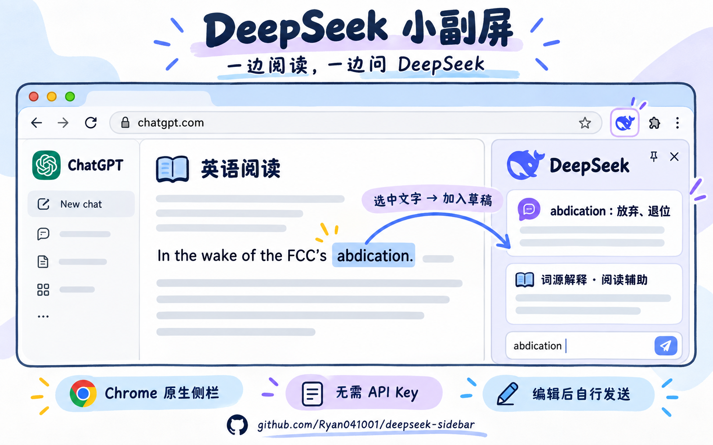
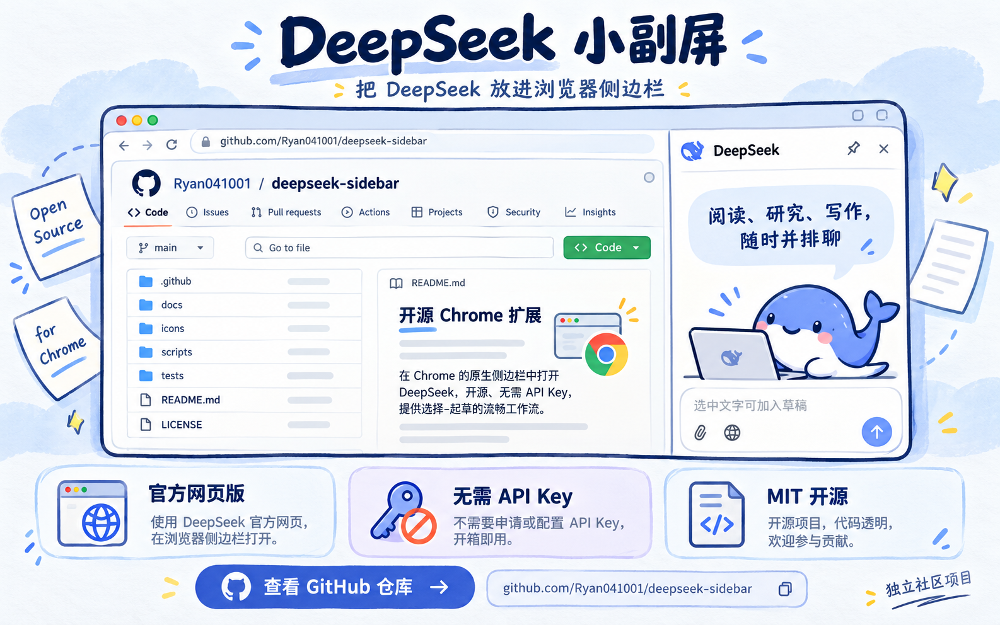

<div align="center">

<p align="center">
  
</p>

# DeepSeek Sidebar

**一边浏览网页，一边使用 DeepSeek。**

在 Chrome 原生侧边栏打开 DeepSeek 官方网页版，阅读、查资料或写作时都能随时提问。

[](LICENSE)


[下载安装](../../releases/latest) · [使用指南](#使用指南) · [隐私与安全](docs/PRIVACY.md) · [参与贡献](CONTRIBUTING.md) · [English](README.en.md)

</div>

---

## 功能

DeepSeek Sidebar 是一个轻量、开源的 Chrome 扩展，将 **[chat.deepseek.com](https://chat.deepseek.com/)** 直接放入浏览器原生侧边栏。

侧栏直接使用官网的聊天界面，无需 API Key。账号、模型、历史对话和消息收发均由官网提供。

| 功能 | 说明 |
| --- | --- |
| **官网侧栏** | 当前网页与 DeepSeek 并排显示 |
| **添加选中文字** | 通过右键菜单或快捷键，将选中文字追加到官网输入框 |
| **保留已有草稿** | 多段文字按顺序追加，检查、编辑后自行发送 |
| **暂存待添加文字** | 按窗口暂存，输入框就绪后添加，支持重试与清空 |
| **无需额外配置** | 无需 API Key，扩展不提供代理服务或额外订阅；官网服务适用其自身规则 |
| **开源与权限说明** | Manifest V3，无第三方运行时依赖，权限和数据流均有文档说明 |

> **测试情况：** 当前版本已在 Chrome 中完成实际使用测试，官网登录、聊天收发和选中文字添加均正常。自动化检查覆盖草稿保留、不自动发送、队列隔离和嵌入规则。详见 [测试文档](docs/TESTING.md)。

## 功能示例

### 一边阅读，一边问 DeepSeek

阅读英文文章时，选中不熟悉的单词或句子，加入侧栏输入框。编辑后发送，就可以询问词义、词源或句子结构，并对照原文查看回答。

<p align="center">
  
</p>

### 查资料与写作

查看 GitHub 仓库、查资料或写作时，可以在侧栏打开 DeepSeek。需要讨论网页内容时，选中文字加入输入框，或直接粘贴相关内容后提问。

<p align="center">
  
</p>

*以上为功能示意图，实际界面以 Chrome 和 DeepSeek 官网为准。*

## 快速开始

**环境要求：Chrome 116 或以上，建议使用最新稳定版。**

1. 在 [Releases](../../releases/latest) 下载 `deepseek-sidebar-*.zip`，解压到一个固定目录。
2. 打开 `chrome://extensions/`，开启右上角的 **开发者模式**。
3. 点击 **加载已解压的扩展程序**，选择包含 `manifest.json` 的目录。
4. 在 Chrome 工具栏的扩展菜单中固定 **DeepSeek 小副屏**。
5. 点击图标，在侧边栏中登录 DeepSeek，即可开始使用。

安装无需 Node.js、npm 或构建步骤。ZIP 需要先解压，不能直接拖入浏览器安装。

**更新版本：** 用新版本文件替换原安装目录，再到扩展管理页点击重新加载。操作前请保存未发送的草稿。不要删除仍由 Chrome 加载的目录。

## 使用指南

### 与当前网页并排使用

点击工具栏中的  打开侧栏，拖动边界可调整宽度。侧栏的位置由 Chrome 设置控制。

### 添加选中文字

1. 在当前网页选中一段文字。
2. 右键选择 **添加到 DeepSeek 输入框**。
3. 在官网输入框中查看、编辑，再自行发送。

也可以使用 **Alt + Shift + D**；macOS 对应 **Option + Shift + D**。快捷键可在 `chrome://extensions/shortcuts` 中修改。

- **有选中文字：** 打开侧栏并添加文字；侧栏已打开时继续添加，不会关闭。
- **没有选中文字：** 只切换侧栏开关，不添加内容。

Chrome 141+ 只关闭当前窗口的侧栏。Chrome 116–140 缺少原生关闭接口，兼容方案会同时关闭本扩展在其他窗口的侧栏，建议使用最新版 Chrome。

### 管理待添加文字

右键点击**扩展图标**，可在新标签页打开 DeepSeek、重试添加，或清空当前窗口的待添加文字。

- 图标数字表示待添加段数；出现 **!** 时，悬停图标查看提示。
- 每个窗口最多暂存 **20 段**文字，每段最多 **60,000 个字符**，更长的内容请分段添加。
- 清空待添加文字不会修改官网已有草稿；已经发出的写入请求可能仍会完成。
- 如果文字已出现在输入框，但仍提示确认超时，请清空待添加文字，避免重试造成重复添加。

## 隐私与权限

扩展没有自有账户、统计分析、广告或内容代理，也不收集账号凭据。待添加文字暂存在本地会话存储中。文字加入官网输入框后，即使尚未发送，也可能被官网读取，适用 DeepSeek 的隐私政策。

权限限定在侧边栏、原生菜单、用户主动触发的选中文字读取，以及 `chat.deepseek.com`。不申请所有网站的持久访问权限。

**嵌入安全说明：** 为在侧栏显示官网，扩展会移除匹配的官网 iframe 响应中的嵌入限制和 CSP 响应头。这会降低嵌入页面的部分安全防护。规则只匹配本扩展发起的官网子框架请求，不影响普通标签页。使用前请阅读 [完整权限与安全说明](docs/PRIVACY.md)。

## 兼容性与故障排查

使用情况受官网状态、登录策略、浏览器 Cookie 设置和网络环境影响。扩展无法绕过官网的验证码、限流或访问限制。

- **无法登录或发送：** 先在普通标签页确认官网是否正常，完成必要登录后重新打开侧栏。重新加载前保存草稿。
- **文字未追加：** 确认已登录并打开对话，查看扩展图标提示；跨域 iframe 中的选中文字优先使用右键菜单。
- **快捷键无效：** 检查是否与其他扩展冲突。Chrome 内部页面、扩展商店与部分 PDF 页面不允许脚本读取。
- **官网更新后异常：** 查看 [已知问题](../../issues) 或提交可复现报告，附浏览器版本和脱敏步骤，不上传账号、对话或 Cookie。

Edge、Brave 等浏览器尚未经过本项目的正式兼容性测试。

## 开发与贡献

使用 Node.js 22+、Python 3 和 Git，在项目根目录运行：

```sh
npm run check
npm test
npm run audit:source
npm run pack
```

基础检查和打包无需安装 npm 依赖。安装包输出到 `dist/`，不包含测试数据、浏览器 profile 或开发工具。

欢迎提交问题、文档改进和 Pull Request。开始前请阅读 [贡献指南](CONTRIBUTING.md)、[架构说明](docs/ARCHITECTURE.md) 和 [测试指南](docs/TESTING.md)。版本变化见 [CHANGELOG](CHANGELOG.md)，安全问题请参阅 [SECURITY](SECURITY.md)。

## 友情链接

- [LINUX DO](https://linux.do/) — 技术交流社区。

## 许可证与声明

项目代码以 **[MIT License](LICENSE)** 开源，支持在遵守许可证的前提下使用、修改和分发，包括商业使用。

本项目由社区独立开发，**非 DeepSeek 官方扩展，也未获官方认可**。第三方品牌、商标和标识的权利不随代码许可证授予，详见 [NOTICE](NOTICE.md)。
